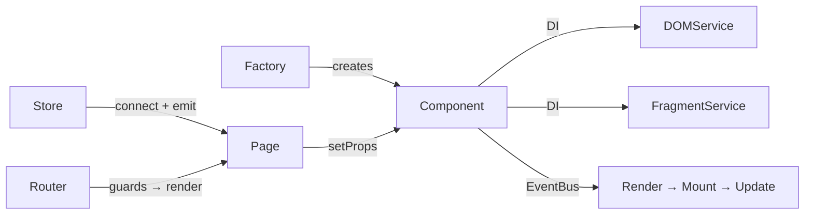

English | [**Русский README** ➡️](README.md)

**mmpy.chat** — a chat with notes written in TypeScript from scratch, without React/Vue.

*A component system, reactive store, router, WebSocket, i18n — everything written by hand.*

   

**Demo (with guest mode 👻)**: [GH-Pages](https://faustseele.github.io/mmpy.chat/) & [Netlify](mmpy-chat.netlify.app)

**[Design in Figma](https://www.figma.com/design/SaTdkvEMsWoRl2dZn7S9Ab/mmpy-chat?node-id=0-1&t=PrP08m0m5Cfj2EMi-1)** &nbsp;·&nbsp; **[API Swagger](https://ya-praktikum.tech/api/v2/swagger)**

---


---

### Key decisions

- Everything from scratch — components with lifecycle, DI, EventBus, without frameworks.
- Feature-Sliced Design — layers, boundaries, one-way dependencies.
- WebSocket chat with token authorization and message history.
- UI designed before coding in Figma → pixel-perfect layout.

---

### Stack

- **Language** – TypeScript (strict, generics, type guards, utility types)
- **Templates and styles** – Handlebars; PostCSS + CSS Modules
- **Build** – Vite
- **Tests and linting** – Vitest (jsdom); ESLint, Stylelint
- **API and deployment** – REST (XHR) + WebSocket; Netlify

---

### Architecture

**Feature-Sliced Design:** `src/app` → `src/pages` → `src/features` → `src/entities` → `src/shared`

Components are created via **Factory + DI** — dependencies are injected rather than imported directly:



- [`shared/lib/Component/`](src/shared/lib/Component/) — base class with lifecycle on EventBus (Render → Mount → Update → Unmount)
- [`shared/lib/DOM/DOMService.ts`](src/shared/lib/DOM/DOMService.ts) — element creation/update, listener management
- [`shared/lib/Fragment/FragmentService.ts`](src/shared/lib/Fragment/FragmentService.ts) — Handlebars → DocumentFragment
- [`app/providers/store/`](src/app/providers/store/) — reactive store + connect with Page component
- [`app/providers/router/`](src/app/providers/router/) — History API router with guards

---

### Functionality

- Authorization (login / registration) with form validation
- List of chats and notes, real-time messaging via WebSocket
- Profile editing (avatar, data, password)
- Routing with authorization guards
- i18n — 7 languages, switching on the fly via Store
- Responsive layout, mobile UX

---

### CI/CD & Testing

**CI:** GitHub Actions — lint, test, build run in parallel on every PR. Build only triggers after lint and tests pass.

**Unit tests** (Vitest + jsdom) cover core modules: EventBus, Store, HTTPTransport, validation. An integration test for the guest flow — authorization → navigation → sending a message.

**Lighthouse:** 94–100 on all routes (Performance, Accessibility, Best Practices, SEO).

---

### Run

```bash
npm install && npm run dev
```

| Command             | What it does                     |
| ------------------- | -------------------------------- |
| `npm run dev`       | Dev server with HMR              |
| `npm run build`     | Production build                 |
| `npm run lint`      | ESLint + TS + Stylelint          |
| `npm test`          | Tests (watch)                    |
| `npm test:coverage` | Tests with coverage report       |

**Routes:** `/` · `/sign-up` · `/messenger` · `/settings` · `/404` · `/500`