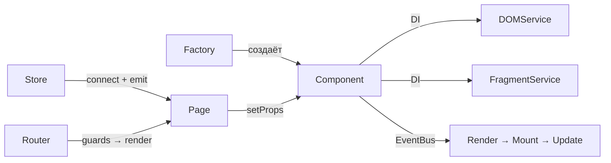

[**English README** ➡️️](README.en.md) | Русский

**mmpy.chat** — чат с заметками на TypeScript с нуля, без React/Vue.

_Компонентная система, реактивный стор, роутер, WebSocket, i18n — всё написано руками._

Lighthouse benchmarks on `/messenger` page:

   

**Демо (с гостевым модом 👻)**: [GH-Pages](https://faustseele.github.io/mmpy.chat/) & [Netlify](mmpy-chat.netlify.app)

**[Дизайн в Figma](https://www.figma.com/design/SaTdkvEMsWoRl2dZn7S9Ab/mmpy-chat?node-id=0-1&t=PrP08m0m5Cfj2EMi-1)** &nbsp;·&nbsp; **[API Swagger](https://ya-praktikum.tech/api/v2/swagger)**

---


---

### Ключевые решения

- Всё с нуля — компоненты с lifecycle, DI, EventBus, без фреймворков.
- Feature-Sliced Design — слои, границы, однонаправленные зависимости.
- WebSocket-чат с токен-авторизацией и историей сообщений.
- UI спроектирован до кода в Figma → pixel-perfect вёрстка.

---

### Стек

- **Язык** – TypeScript (strict, generics, type guards, utility types)
- **Шаблоны и стили** – Handlebars; PostCSS + CSS Modules
- **Сборка** – Vite
- **Тесты и линтинг** – Vitest (jsdom); ESLint, Stylelint
- **API и деплой** – REST (XHR) + WebSocket; Netlify

---

### Архитектура

**Feature-Sliced Design:** `src/app` → `src/pages` → `src/features` → `src/entities` → `src/shared`

Компоненты создаются через **Factory + DI** — зависимости инжектятся, не импортируются напрямую:



- [`shared/lib/Component/`](src/shared/lib/Component/) — базовый класс с lifecycle на EventBus (Render → Mount → Update → Unmount)
- [`shared/lib/DOM/DOMService.ts`](src/shared/lib/DOM/DOMService.ts) — создание/обновление элементов, управление слушателями
- [`shared/lib/Fragment/FragmentService.ts`](src/shared/lib/Fragment/FragmentService.ts) — Handlebars → DocumentFragment
- [`app/providers/store/`](src/app/providers/store/) — реактивный стор + connect с Page-компонентом
- [`app/providers/router/`](src/app/providers/router/) — History API роутер с гардами

---

### Функциональность

- Авторизация (вход / регистрация) с валидацией форм
- Список чатов и заметок, обмен сообщениями в реальном времени через WebSocket
- Редактирование профиля (аватар, данные, пароль)
- Роутинг с гардами авторизации
- i18n — 7 языков, переключение на лету через Store
- Адаптивная вёрстка, мобильный UX

---

### CI/CD и тестирование

**CI:** GitHub Actions — lint, test, build параллельно на каждый PR. Сборка запускается только после прохождения линтинга и тестов.

**Unit-тесты** (Vitest + jsdom) покрывают core-модули: EventBus, Store, HTTPTransport, валидацию. Интеграционный тест на гостевой флоу — авторизация → навигация → отправка сообщения.

**Lighthouse:** 94–100 на всех маршрутах (Performance, Accessibility, Best Practices, SEO).

---

### Запуск

```bash
npm install && npm run dev
```

| Команда             | Что делает                  |
| ------------------- | --------------------------- |
| `npm run dev`       | Дев-сервер с HMR            |
| `npm run build`     | Продакшн-сборка             |
| `npm run lint`      | ESLint + TS + Stylelint     |
| `npm test`          | Тесты (watch)               |
| `npm test:coverage` | Тесты с отчётом по покрытию |

**Маршруты:** `/` · `/sign-up` · `/messenger` · `/settings` · `/404` · `/500`
